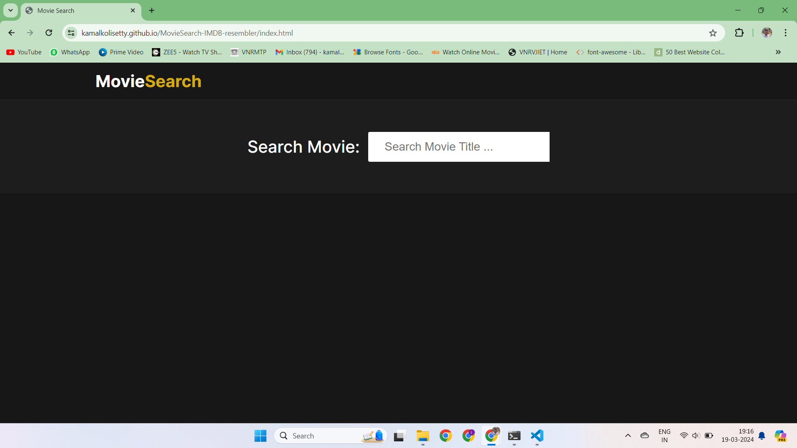
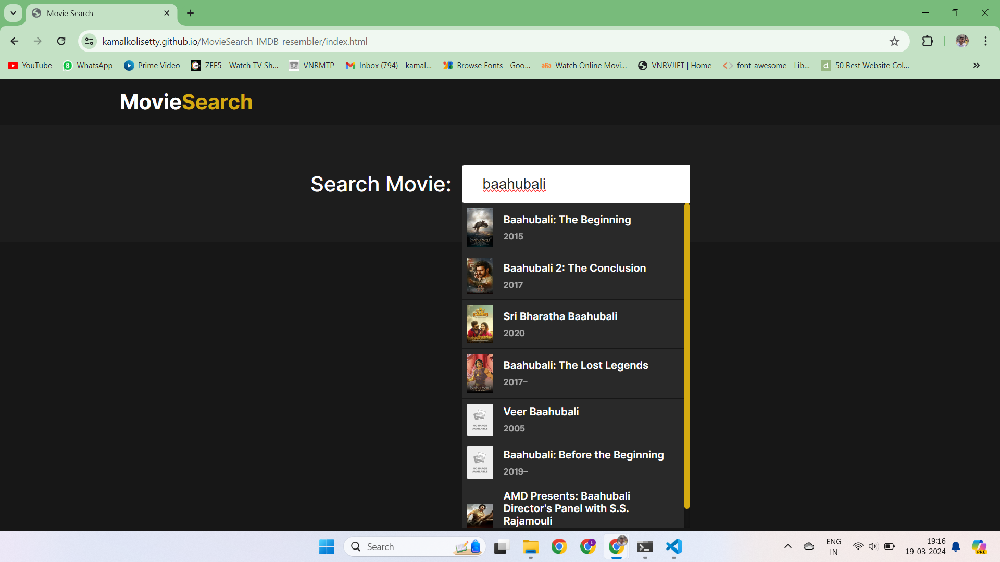
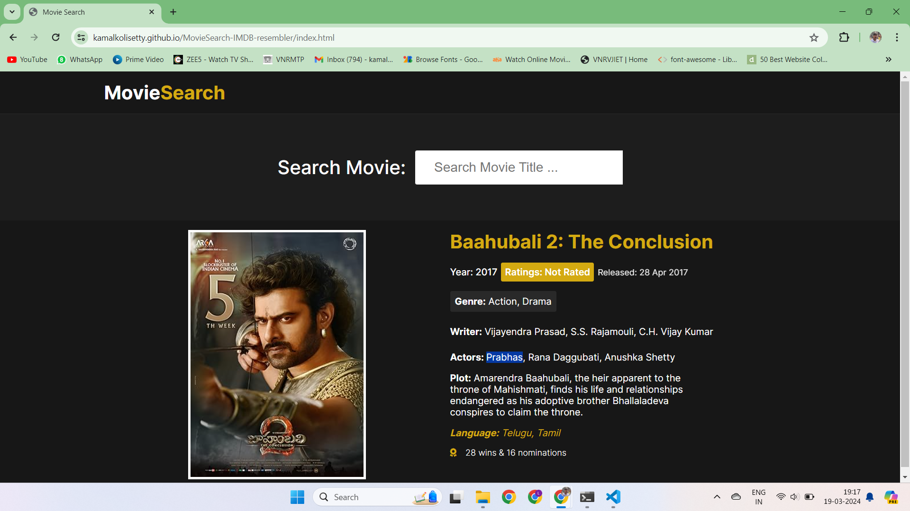

# Movie Search

Movie Search is a web application that allows users to search for movies and view detailed information about them. It fetches data from the Open Movie Database (OMDb) API.

## Features

- Search for movies by title.
- View a list of search results with movie posters and basic information.
- Click on a movie to view detailed information including the poster, title, year, ratings, plot, actors, and more.


## Technologies Used

- HTML5
- CSS3
- JavaScript (ES6+)
- [Font Awesome](https://fontawesome.com/) for icons
- [OMDb API](http://www.omdbapi.com/) for movie data

## Installation

1. Clone the repository:

    ```bash
    git clone https://github.com/your-username/movie-search.git
    ```

2. Open the project folder:

    ```bash
    cd movie-search
    ```

3. Open the `index.html` file in your web browser.

## Usage

1. Enter a movie title in the search box.
2. Click on the movie from the search results to view detailed information.

## Contributing

Contributions are welcome! If you'd like to contribute to this project, please follow these steps:

1. Fork the project.
2. Create your feature branch (`git checkout -b feature/AmazingFeature`).
3. Commit your changes (`git commit -m 'Add some AmazingFeature'`).
4. Push to the branch (`git push origin feature/AmazingFeature`).
5. Open a pull request.

## License

This project is licensed under the MIT License - see the [LICENSE](LICENSE) file for details.


## Contact

- [Email -kamalkumarkolisetty@gmail.com ](kamalkumarkolisetty@gmail.com)

# DEMONSTRATION 

Home Page



Searching a movie name



Result




